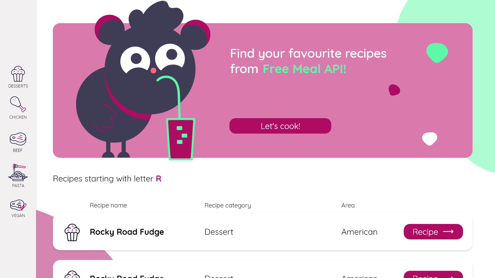

# Simple recipe listing app based on Free Meal API

## Table of contents
1. Description
2. Development process
3. Technologies and sources
4. Possible improvements

## Description
This app is an simple Free Meal API consumer that shows a list of recipies and their details.
App consists of views described in list below.
- Main page with banner and list of recipes starting with random letter,
- Category page with recipes list from specified category,
- Recipe details page with recipe name, ingredients, instruction and photo of the meal,
- Error page for HTTP 404 error.

## Development
Development process started with a mockup preparation. Since I wanted to improve my UX Design skills I tried to create a simple and easy to use interface which can be improved later.

I have setup my environment, installed needed packages and gathered resources. I have started with implementation of main page and its components because some of them could be used later. Then I have moved to category and details page and ended on full error page implementation. During the process, there were some ESLint fixes that allowed me to fix some code styling issues. At the end, I wrote some tests for components that were uses to create whole views.

## Technologies and resources
App is based on **React** and **TypeScript**. It was written with Functional Components.
For styles, **Sass**  with SCSS syntax was used.
Tests were made with **React Testing Library** and **ESLint** was chosen as a linter.

Icons come from [Lordicon](https://lordicon.com/ "Lordicon"). Illustrations were taken from [UnDraw](https://undraw.co/ "UnDraw").

Mockup was made with [AdobeXD](https://www.adobe.com/pl/products/xd.html "AdobeXD"). As an IDE [Visual Studio Code](https://code.visualstudio.com/ "Visual Studio Code") was used. 

## Possible improvements
Following improvements can be made:
- more tests, especially for fetching data and redirects,
- UI improvements to match more with suggested mockup,
- usability testing for mockup improvement,
- inline documentation.

